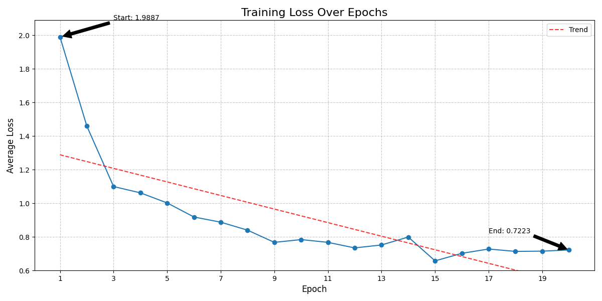

# Cifar10 Classification

This is a simple example of how to use the `cifar10` dataset with `libtorch`and `opencv`. The code is written in C++ and uses custom Dataset class to load the data. The model is a simple Convolutional Neural Network.

## Requirements

- CMake
- OpenCV
- Libtorch

## Build

```bash
mkdir build
cd build
cmake ..
make
```

## Train

```bash
./cifar10_classification train
```

## Test

```bash
./cifar10_classification test
```

## Results

The model achieves an accuracy of around 88% after 20 epochs.


